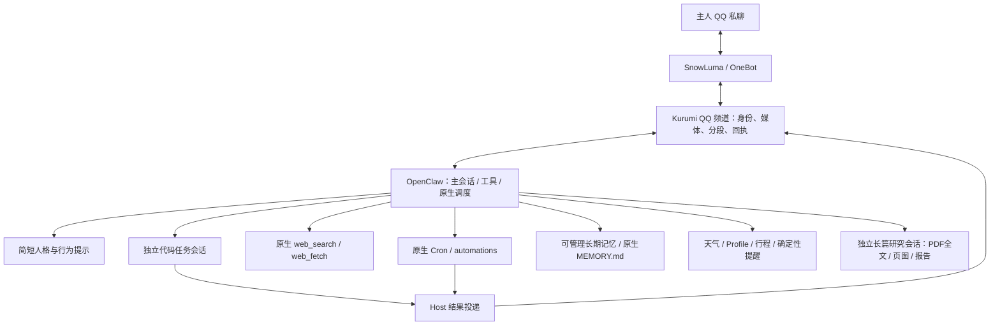

# QQ 融合助手架构与开发计划

现在应该从哪里继续：完整迁移进行中；领域迁移已通过真实CRUD及跨重启提醒送达/对账；人格与可管理记忆已通过，QQ分段/表情已通过，项目维护与后台全文研究已通过，周期天气及研究取消已通过，继续运维切换，最终验收并切换默认服务。

## TODO 与当前状态

本阶段目标已由用户明确扩大为**完整迁移**，不能在原型验收点结束。用户已选择：Kurumi人格为主；代码先接入融合项目独立副本；通过验收后融合方案成为默认并配置自启，旧服务停止但数据保留。

- [ ] 完整迁移退出验收：旧领域能力、QQ交互、人格与记忆、项目维护、全文研究、定时执行、默认服务与回退均有实测证据。

- [x] 保存旧 OpenClaw 基线、清理 Git；两套原件保留，独立源码与运行目录已建立。
- [x] 写出并实测 OpenClaw 唯一宿主 + SnowLuma OneBot 频道的主路径。
- [x] 合成可信入站经过真实 Host/模型，真实本人 QQ 文本、引用、图片出站；重复入站拒绝。
- [x] 后台代码修复与主聊天并行、实际执行固定测试、查询/取消、QQ 结果回传。
- [x] 原生提醒创建/修改/取消；确定性 command 提醒跨重启投递；聊天创建的 agentTurn 提醒到点投递。领域迁移新增真实模型两阶段确认CRUD已通过。
- [x] 公开论文搜索、读取 arXiv 原页面、给出来源并声明只读摘要。
- [x] 原型阶段15项融合离线测试通过并完成会话清理；完整迁移阶段已重新开启测试RPC，当前测试结束后会再次关闭。
- [ ] 主人亲自发 QQ 文本、引用、新上传图片，检查自然对话手感与连发体验。
- [x] QQ短段分发、节奏控制与表情库副本已接入；真实两段文字+晚安表情投递、回读通过。
- [x] 已注册融合项目独立Git副本，后台真实修复/隔离检查/本地提交与主聊天并发通过；Git显式文件提交复验通过。
- [x] 独立研究会话实际读取19页PDF全文，核对2页图表，生成带哈希/页码报告；研究中主聊天约6.4秒回复。
- [x] 迁移天气/Profile/行程，适配新频道可信身份后回归原确认核心；真实天气读取、所在地确认写入/恢复、行程新增已通过，原有数据保留。
- [x] Kurumi人格与6条稳定资料已迁入私有目录；长期记忆真实模型增删改查、网页写入拒绝通过，测试后原有条目哈希一致。自动记忆关闭。
- [x] 自然语言确定性提醒正式后端：原文确认CRUD、固定稳定runner、真实跨重启投递与公开API送达对账。
- [x] 确认口令缩短为12位派生码，保留完整ID/Hash协议兼容；17项核心、161项领域测试及真实模型提醒CRUD通过。
- [ ] 补诊断入口、常态配额最终配置及systemd上线方案。

上述未完成项现已纳入本轮完整迁移范围；技术选择由我自主决定，不将可解决的实现问题转给主人。真实人类输入与陪伴风格主观反馈可单列待主人验收，其他工作继续。

## 架构取舍与原因

**采用 OpenClaw 作为唯一助手宿主，Kurumi 作为人格与能力组织层，SnowLuma 作为 QQ 传输。暂不把 DSH 再嵌入 OpenClaw。**

判断依据不是迁移成本：新频道已经复现真实文本/引用/图片投递，OpenClaw 的原生会话和调度也实际承担了后台代码任务、取消和提醒，因此没有必要同时维护两套会话、任务、记忆与故障状态。DSH 的交互优点优先在频道层复用；若以后出现原生宿主确实不能满足的任务，再评估是否需要外部执行器。



新代码只补频道与薄任务适配器；没有新建通用任务引擎、第二个调度器或人格记忆引擎。插件依赖当前已安装 OpenClaw 2026.9.7；升级前必须重跑契约验收，启动脚本会拒绝不匹配的 SDK 版本。

### 当前体验的实际边界

- 主聊天可快速接受代码任务后继续聊天；后台结果由 Host 直接回到同一主人。代码示例6项测试通过，取消确实终止运行。
- 简单提醒已通过真实模型提案/确认管理固定command Cron，到点不依赖模型，跨重启实际QQ收到。送达对账已通过公开宿主接口完成。复杂agentTurn定时任务仍需模型可用。
- 快速搜索使用原生工具；长篇研究使用独立researcher会话与公开学术PDF工具。RAG论文19页全文读取及第2/6页图表核对、带来源/哈希/页码报告已通过；全文文字读取不等于每页图表都视觉核对。
- 人格模板已精简，闲聊不强制任务化；陪伴质量尚无长周期或主人主观验收。不能据一次聊天声称已完成情感陪伴迁移。
- 项目worker限制在注册的独立Git副本；检查和Git在Bubblewrap中运行，只有项目可写、固定夹具只读、无外网且无助手私有目录。它不提供任意shell和推送，检查范围由项目注册表明确列出。

## 保护边界与精确路径

| 用途 | 路径 / 状态 |
| --- | --- |
| 原 OpenClaw 源码 | `/home/afrangry/.openclaw`，Git 根在此；基线 `e903c09`，标签 `baseline/pre-integration-2026-10-05`；保留文档初稿后停在 `f8319c1` |
| 原 SnowLuma | `/home/afrangry/snowluma`，源码/配置未参与改造，继续提供 QQ 传输 |
| 原 qq-bridge | `/home/afrangry/桌面/qq-bridge`，源码/配置未修改；`qq-bridge.service` 已停止 |
| 原完整备份 | `/home/afrangry/kurumi-baselines/2026-10-05-before-integration/`，含已验证 Git bundle、工作树差异、状态清单、完整运行目录 tar.gz |
| 融合源码 | `/home/afrangry/kurumi-fusion`，独立 clone --no-hardlinks，分支 `integration/onebot`；不推送远端 |
| 融合运行状态 | `/home/afrangry/.openclaw-fusion`，目录700、凭证600；Gateway `127.0.0.1:18890` |
| 频道源码 | `/home/afrangry/kurumi-fusion/chatbot/plugins/kurumi-qq/` |
| 任务适配器 | `/home/afrangry/kurumi-fusion/chatbot/plugins/kurumi-tasks/` |
| 主人格模板 | `/home/afrangry/kurumi-fusion/scripts/fusion/templates/AGENTS.md`；运行副本在 `.openclaw-fusion/workspace/` |
| 隔离代码样例 | `/home/afrangry/.openclaw-fusion/code-workspace`；固定测试原件在融合源码 `scripts/fusion/fixtures/test_stats.py` |
| 验收证据 | `/home/afrangry/kurumi-fusion/docs/verification/fusion/` |
| 早期架构对比 | `/home/afrangry/snowluma/architecture-evaluation/REPORT.md` |

**后续主要工作在 kurumi-fusion，不在原 `.openclaw` 中直接改造。本文是当前权威状态；原 `.openclaw/docs/9_...` 仅保留开始时的快照。**

运行时仍借用只读已安装 OpenClaw、ws 和 Tavily 插件包；这是同一台机器上的原型部署，还不是可搬机器的独立安装包。旧 OpenClaw 18789 与 DSH 仍可作为回退基础保留；新方案不调用 DSH。禁止同时启动旧 qq-bridge 和融合 QQ 消费者，启动脚本已检查旧 bridge 状态。

原始完整备份是在旧服务运行时采集，不能宣称跨数据库事务一致。融合副本已在停止18890进程后生成停机快照 `/home/afrangry/kurumi-baselines/2026-10-05-fusion-acceptance/runtime.tar.gz`，gzip完整性验证通过，SHA-256 `225eedd7cdd5186a1713b7766273b23ad30e3dd210b03aa67ee9d51cdacee34f`；不要混淆两种备份保证。

## 数据与外发

- `channel/channel.sqlite`：`inbound(id,status,at,origin)` 存入站去重；`outbound(id,status,message_id,at)` 存投递预留和回执。不是业务记忆或第二套调度库。
- Host 数据：`state/openclaw.sqlite` 与 `agents/{main,worker}/agent/openclaw-agent.sqlite`；不与旧目录共享可写数据库。
- `channel/task-receipts.jsonl` 只保存任务工具的真实运行标识与结果，用于查询/取消时绑定 sessionKey/runId。Host 是运行状态事实来源。
- `channel/native-tool-receipts.jsonl` 是验收记录，测试入口关闭后不再通过该 hook 写入。
- 图片只允许已暂存文件或受限 QQ CDN 入站；正文中的 CQ 字符串不提升为可信控制段。引用只读取同一主人私聊的消息。
- 发送仅允许 QQ 365999865，群与其他收件人均拒绝。**累计真实外发13条；迁移期累计尝试上限已调为40，滚动24小时上限120，13条均有回执并回读。** 失败/未知尝试同样占用持久配额，重启不能绕过。
- Host durable delivery ID 可用时作为幂等键；已成功的相同键复用回执。回执丢失则 unknown，不自动重发。没有 durable ID 的普通调用不能保证全局恰好一次。
- 入站失败保留 failed，不自动重新运行可能已产生副作用的模型回合。下一阶段应补主人可见的诊断入口。

## 验收证据与已修正的坑

| 证据 | 已验证内容 / 限制 |
| --- | --- |
| `01-native-inbound.json` | 合成主人入站→真实Host/模型→本人QQ；重复事件拒绝 |
| `02-channel-tests.txt` / `17-final-tests.txt` | 频道12项 + 任务3项；目标限制、去重、媒体边界、取消屏障、未知回执、防重复发送、错误状态、任务身份绑定 |
| `03-native-media.json` | 暂存图片与引用进真实模型；真实QQ引用/文本/图片出站。尚非主人新上传图片 |
| `04-native-cron.json` | 原生command任务创建、同ID修改、取消；跨重启后执行及投递成功 |
| `05-native-concurrency.json` | 实际25秒慢工具启动，另一普通会话约2.1秒完成，慢会话取消成功 |
| `06...` / `07...` / `08...` | 被放弃的自定义提醒封装与command管理失败证据，不是现行通过项 |
| `09-native-agent-reminder.json` | 真模型通过automations创建、修改、取消、列表核对 |
| `10-background-code.json` | QQ主会话启动后台代码修复；主聊天并行；后台结果本人QQ回传。首次未执行检查工具，报告如实披露 |
| `11-worker-check.json` | 修正工具策略后，真实worker实际调用固定检查工具，6项通过；独立Python测试同样6项通过，测试文件哈希未变 |
| `12-task-control.json` | 实际task工具status/cancel；aborted=true，终态error/stopReason=rpc，没有终态外发 |
| `13-natural-reminder-delivery.json` | 聊天创建agentTurn提醒，实际到点succeeded/delivered，自动删除；并经QQ回读 |
| `15-research.json` | 实际web_search + web_fetch读取arXiv，正确作者/年份/链接，明确只读摘要 |
| `16-closeout.json` / `18-final-runtime.json` | 合成会话原生轮换、测试入口关闭且RPC不可调用、频道连接、无启用中任务、发送账本保留 |
| `receipts.json` | 累计已发送13条的脱敏消息ID与实际回读段类型 |

需要保留的实现教训：

1. 工具必须在 manifest 声明 `contracts.tools`；模型口头说“完成”不能代替实际调用。未注册慢工具时模型曾输出完成标记，测试按真实marker正确判失败。
2. 每个工具作用域不能同时配置 allow 与 alsoAllow；多agent需 explicit ownership。coding profile 与 allow 求交会滤掉自定义检查工具；worker现用 full profile + 精确5项 allow，绝非全部开放。
3. native agent 的 runId 可以是调用方24位幂等键，不能假定UUID。查询/取消同时校验已登记run/session配对。
4. 原生 automations 禁止模型创建command；自定义封装缺少管理授权时不能伪装成功。未通过的封装已移除，没有向模型工具注入管理员凭证绕过边界。
5. 一次性提醒自动删除后，不应再次无条件删除。首版验收清理脚本因此报错，后续按持久Cron记录核对，未重发。
6. **关闭memory slot不自动删除以前登记的记忆整理Cron。** 收尾发现一条enabled的旧自动声明，已通过原生API移除并跨重启确认未再出现。三个disabled的heartbeat/skill review声明保留，无启用中任务。早先“列表为空”的说法已修正为“没有测试提醒/没有启用中任务”。

## 启动、检查与回退

当前是手动启动的试运行，不安装新的开机服务。SnowLuma/QQ原服务继续运行；旧bridge仍有原自启设置，整机重启后先检查，不能直接再启动融合消费者。

```bash
cd /home/afrangry/kurumi-fusion
node scripts/fusion/link-dependencies.mjs
systemctl --user stop qq-bridge.service
node scripts/fusion/run-gateway.mjs
```

运行命令占用前台；不要同时重复启动。另一个终端只读检查：

```bash
cd /home/afrangry/kurumi-fusion
node scripts/fusion/probe-final.mjs
node scripts/fusion/inspect-receipts.mjs
```

`probe-final` 的“无启用任务”断言仅适用于本轮空任务交接，日后用户真实创建提醒后应按业务状态查看，不能把存在合法提醒当故障。

退回原 SnowLuma/DSH 链路：

```bash
cd /home/afrangry/kurumi-fusion
node scripts/fusion/stop-gateway.mjs
systemctl --user start qq-bridge.service
```

已实测融合停止后18890释放、再次启动连接正常。没有实际重启旧bridge做联网回滚验收，避免旧规则向未授权联系人或群发言。回退不需要删除融合目录或修改原件，也不需要 git reset --hard。

新建运行目录时依次执行 `prepare.mjs`、`configure-worker.mjs`、`configure-research.mjs`；prepare拒绝覆盖既有文件。需要先由上述link脚本确认本机依赖版本。不要直接复制整套旧运行目录覆盖融合状态。

## 自主开发规则与次日交接

继续遵循 `docs/tp2.txt`：每阶段及压缩恢复后完整读本文；维护当前状态而不是堆叠相互矛盾的计划。独立阶段提交，验收结果有持久证据；不自动推送，不提交密钥、运行库或私人记忆。

用户授权夜间本人QQ测试，禁止其他人/群。最初10条是原型自设预算；按完整迁移授权，现设累计40次尝试的迁移预算，滚动24小时120次常态配额，账本从未清空。默认切换时移除迁移累计上限，保留滚动配额。

两张重置卡仅在剩余额度严格低于5%、且仍有必要工作时依次使用；本轮在剩余4%、必要收尾尚未完成时使用了第一张，工具确认reset成功，第二张保留。任务结束后不继续消耗或兑换。

明天无需先替我决定架构。推荐直接试三件事：发一张图片并引用它、闲聊中要求启动代码任务、创建一分钟后的简单提醒；具体发送次数仍受剩余配额限制。真正需要你反馈的是回复语气、分段节奏和主动程度。其他技术项按TODO和验收结果自主推进。

## 完整迁移阶段决策

- 原领域模块存在硬编码 qqbot/c2c 路线；已在副本兼容新频道，沿用已有数据库和确认语义，不另建重复天气/行程实现。
- 确认只读取本次主人消息原文。新频道原RawBody曾含拼接引用，已将原文与引用上下文分离并通过防重放回归。
- 普通后台任务继续复用Host。完整迁移验收期间沿用本人QQ外发授权；历史10条是上一轮验收预算，账本保留，新增验收预算与正常交互配额会显式区分，不靠清空历史计数。

### 领域迁移检查点（2026-10-05 07:10）

- 融合副本已有天气/Profile/行程/提醒数据库独立副本，SQLite backup 后完整性与外键检查通过；9条历史提醒均为终态，没有待迁移的旧活动提醒。旧库未写入。
- 新频道确认入口严格绑定本人、私聊、主会话和原始 RawBody；引用正文只进入模型上下文，不作为确认授权。confirmation-core 16项、领域161项与频道14项离线测试通过。
- `docs/verification/migration/06-domain-read.json` 证明真实模型调用天气及Profile读取，临时查询未改所在地/行程。`08-profile-confirmation.json` 证明未确认写入拒绝、原文确认成功、重复确认幂等，并通过同一流程恢复原所在地。
- 确定性提醒采用受限的宿主原生服务后端：仅接受已确认领域行记录，固定命令、固定本人路线，调用宿主Cron；不向模型提供通用管理凭证、任意命令或任意收件人。真实CRUD已通过（09-reminder-crud.json），同一个Cron ID原地修改并取消；重启后实际投递与QQ回读成功；领域状态已通过公开cron.list/cron.runs接口对账为delivered（10-reminder-restart-delivery.json）。
- 修正验收清理的来源判断：QQ真实消息ID也可能为负数，不能据此判为合成测试。新增服务端origin标记，旧记录为unknown；只有明确synthetic记录允许自动测试会话清理，unknown/onebot均阻断。此前16-closeout的负ID判断不能作为普遍安全保证。

- 宿主SDK适配要点：固定loopback RPC需要显式传入运行时服务凭证；仅宿主后端读取环境变量，模型参数不接收凭证。cron.add返回需支持job.id。插件实际加载目录可能是临时capture，因此持久Cron cwd使用操作者配置的稳定融合插件安装目录，并验证固定runner存在。前两次失败证据与精确测试job清理记录已保留。

- `11-planning-confirmation.json` 已通过：真实模型生成日期未定行程，确认前无行程写入；确认后新增1条，出发/到达保持null，所在地/天气偏好和原有行程未改动。验收脚本仅把自己创建的标记测试行程设为cancelled，保留提案与审计；不是向助手开放行程删除能力。

### 人格与可管理记忆检查点

采用Kurumi原有人格，私人资料只迁入私有运行目录。稳定用户事实整理为可列出/检索/更正/删除的少量条目，生成Host原生MEMORY.md；不增加向量库或自动“记忆晋升”。修改必须来自当前本人原始消息的明确记忆请求，引用/网页/后台任务不得提供授权。旧版只会聊天与开发测试历史等过期条目不写入新记忆；原件与完整备份仍保留。

- 新版宿主已不再有旧cron_run_logs表；新后端使用公开Cron接口读取观察值，复用原领域状态机，无需维护第二套投递状态算法。RPC读取失败只报告snapshot不可用，不视为送达失败；一次性任务已删除时仍从运行历史确认送达。当前迁移测试全部临时活动任务已结束，保留失败、取消与送达审计。

- 领域检查点提交：`af6732b`。记忆实现：`chatbot/plugins/kurumi-memory/`，单一原生`/home/afrangry/.openclaw-fusion/workspace/MEMORY.md`持久文件，不维护重复数据库。`configure-persona-memory.mjs`把原私人字段整理成6条带来源的资料，并保留旧工作区人格快照在私有migration/persona-before目录。源码不含私人记忆正文。
- `12-memory-tests.txt`4项测试与`13-memory-model.json`真实模型CRUD/拒绝路径通过。原始本人消息必须明确请求写记忆，保存内容须为原文子串；更正指定ID，删除指定ID或完整内容。引用不构成授权，后台会话不可访问，凭证拒绝存入。删除只影响当前长期记忆，历史聊天/备份仍保留，界面明确此边界。
- 下一步优化QQ交互：短闲聊按段自然发送、长报告保留结构、复用只读表情库副本、增加持久滚动日配额；验收阶段保留历史账本并设独立总预算，最终移除试验终身10条限制。然后完成项目注册表、后台全文研究与服务切换。

- QQ交互实现已加入短闲聊2至3段自然分发与450ms间隔；代码、列表、长报告保留结构。表情只读副本共21条，复用旧库标准化/查找代码且保留许可证与SHA；旧库不写入。18项频道离线测试通过（含取消后不再发下一段、滚动配额跨重启、标签不提升权限/任意URL拒绝）。本人真实两段文字与一张表情验收通过，18项频道测试通过；证据15-qq-natural-sticker.json，累计本人QQ11条。

- 确认交互已采用短确认码：由完整proposal ID和payload hash确定性派生12位码，在同一主人/会话/期限内查找唯一待确认提案；跨域歧义拒绝，提交仍使用完整ID/Hash。保留旧完整确认格式兼容。这样手机端不必复制百余字符，也不把模糊“好的”当成授权。

### 项目维护下一步（已完成环境探查）

- 本机已有/usr/bin/bwrap、node、git、pdftotext；Bubblewrap独立命名空间运行Node已成功。采用独立融合Git副本与只读依赖挂载执行检查，隐藏助手私有运行目录，禁外网并限制时间/输出。
- 注册表配置项目根目录、对应Host worker、固定检查命令与只读测试；主聊天只传项目ID和任务说明，不接受任意路径/命令。Git工具限status/diff/本地branch/commit，不提供push；Host会话继续拥有运行/取消和完成回传。真实验收将在融合副本修复一项有失败用例的记忆格式校验问题，独立断言文件不可由worker修改。

- `19-short-confirmation-model.json`实际通过短码创建、同ID修改、取消提醒；没有新增QQ物理外发。短码仅映射原始已冻结ID/Hash，并且必须跨领域唯一，不能用裸“好的”提交。

### 项目维护检查点

- 独立副本`/home/afrangry/.openclaw-fusion/projects/fusion`，配置`projects.json`和只读`project-checks/fusion-memory-revision.mjs`均在私有运行目录；代码代理为Host原生project-fusion会话。原件不参与改造，副本无remote。
- 20-project-before.json真实复现负revision和悬空symlink两处缺陷；后台模型修改store.js，5项隔离测试通过并完成本地提交95a1914，主聊天同时约5.8秒回复。外部检查文件及原测试哈希未改变，已把两行修复审阅后移入主融合源码并增加回归。
- 22-project-maintenance.json复核后标为部分通过：最初Git工具add-all把Host生成的IDENTITY/SOUL/USER三份模板带进提交，模型报告遗漏这点。已用后续提交c9e4c2a从源码跟踪移除并加入忽略规则；不改写历史。新工具必须显式paths，git commit --only只提交指定文件；6项任务测试覆盖保留其他已暂存/未跟踪文件、隔离主机私有目录/网络、固定夹具只读和取消进程。真实限定文件提交复验已通过（23-project-scoped-commit.json，c337875），提交仅README_FUSION.md，副本工作区干净。

### 后台全文研究方案

继续用独立Host researcher会话，主聊天只启动/查询/取消。保留原生搜索/网页读取，新增公开学术PDF下载、按页文本与页面渲染工具，Poppler放入Bubblewrap执行。报告保存源URL、PDF哈希和页码，明确纯文本提取的图表/公式限制；不再把摘要读取算作全文研究。已读取PDF技能，仅做阅读/校验，不创建或改写PDF。

- 项目修复路径通过后，当前实际提供的是已注册项目、登记的检查命令与本地Git维护；不是任意主机命令或自动部署。新增项目须由操作者配置注册表；运行副本保留独立历史，不自动覆盖主融合代码。已验证修改需审阅后才能合入部署源码，本次两行记忆修复已完成该审阅。

### 全文研究检查点

- 24-paper-tests.txt验证URL来源、响应/大小、路径边界；25-paper-fetch.json实际下载arXiv RAG v4 PDF，19页。26-fulltext-research.json验证真实主会话启动researcher，连续读取87,001字符至EOF、查看第2页Figure 1和第6页表格、保存reports/rag-fulltext-acceptance.md；主聊天并发6.4秒。操作者复核页图数值与报告相符。缓存与研究笔记目录分离，Poppler在Bubblewrap中受限执行。
- 实际PDF来源、哈希和读过范围均有记录；研究结果只回本人QQ。下一阶段完成周期天气实际执行、健康诊断、自启切换与停机快照。

### 周期天气与收尾状态

- 27-recurring-weather.json：真实模型创建每日上海时区天气任务、同ID修改、操作者触发一次真实运行后QQ送达、模型删除并核对。天气工具仅对配置本人投递的main原生Cron放开只读，所有领域写入仍需原始私聊确认；周期播报依赖模型，简单确定性提醒不依赖模型。
- 28-research-cancel.json：真实researcher后台任务立即查询/取消，aborted=true，终态rpc停止，无终态发送。复核发现status/cancel审计默认kind误记为code，已改为从原start记录派生；任务绑定权限不受影响。
- 离线31项融合、162项领域、17项确认核心回归通过。运行健康检查已新增health.mjs，可容纳合法活动提醒；systemd单元已准备但尚未切换。下一步关闭测试入口、默认500次滚动24小时配额、启用融合服务并停止旧助手、验证故障恢复与最终备份。
