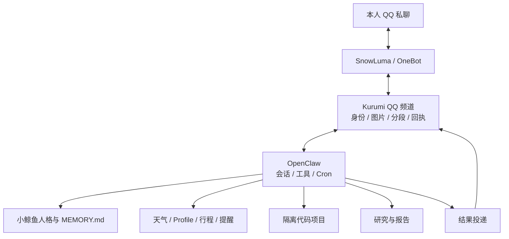

# QQ 融合助手架构与边界

本文只描述当前架构。文档入口在 [`README.md`](README.md)，验收规则在 [`16_验收与测试总表.md`](16_验收与测试总表.md)。

## 架构决定

**OpenClaw 是唯一助手宿主，Kurumi 是能力项目，SnowLuma 提供 QQ 传输，DSH 不在助手主链路内。**

不再维护第二套会话、提醒或 QQ 投递宿主。DSH 可以独立提供网页或模型服务，但启动它不应启动旧 qq-bridge，也不能成为 QQ 消费者。

## 当前资产

| 职责 | 路径或状态 |
| --- | --- |
| 新源码 | `/home/afrangry/kurumi-fusion`，MyBot `main` |
| 新运行状态 | `/home/afrangry/.openclaw-fusion`，凭据、会话、数据库和任务状态 |
| 旧系统 A | `/home/afrangry/kurumi-archive/legacy-openclaw`，只作为回退材料 |
| 旧系统 B | `/home/afrangry/kurumi-archive/qq-bridge`，配合 SnowLuma 和 DSH |
| QQ 传输 | `/home/afrangry/snowluma` 的受管服务 |
| 恢复材料 | `/home/afrangry/kurumi-backups` |

新系统不依赖 `/home/afrangry/.openclaw`；该原路径不存在。旧系统只能按[回退规则](15_旧系统回退.md)恢复，不能直接从归档路径启动。

## 能力边界

- QQ 只接受并投递给主人 `365999865` 的私聊；群聊和其他收件人拒绝。
- 小鲸鱼角色卡来自 `roles/`，DeepSeek Flash 是当前主模型；具体模型和图片验证边界见[文档 11](11_小鲸鱼与DeepSeek切换及确认策略研究.md)。
- 记忆唯一事实来源是运行目录的 `workspace/MEMORY.md`；网页、引用和后台任务不会自动写入。
- 天气、Profile、行程和提醒保留各自数据库；确认、幂等、取消和投递对账由领域模块负责。
- 代码任务在恢复项目副本和 Bubblewrap 中执行；项目检查不能访问生产目录、主机服务总线或真实网络。
- 研究材料与报告保存在私有运行目录；原始论文和页图与可写笔记分离。

## 依赖与升级

OpenClaw SDK 和 `ws` 使用已验收的固定版本。源码依赖由仓库 lockfile 管理，运行状态不进入 Git。升级必须经过依赖检查、构建、领域回归和隔离恢复验收，再更新部署服务。

## 当前运行

- `kurumi-fusion.service`：默认助手，`active/enabled`。
- `snowluma.service`、`snowluma-qq.service`：QQ 传输，`active/enabled`。
- `openclaw-gateway.service`、`qq-bridge.service`：旧消费者，`inactive` 且**已 mask**（2026-10-10 起，单元原件归档在 `/home/afrangry/kurumi-archive/legacy-units/`；手动 `start` 被拒绝）。恢复旧系统前须按[文档 15](15_旧系统回退.md)只解除所选单元的屏蔽。
- `dsh-web.service`：可独立运行，但不消费 QQ。
- `testIngress=false`；验收入口关闭，日常不执行真实外发测试脚本。

## 维护边界

行为修改先改源码和配置来源，再同步私有运行目录；密钥、会话、数据库和长期记忆只在运行目录或私有备份中维护。备份、恢复和旧系统切换分别遵循文档 13、14、15；测试证据统一从文档 16 和 `verification/INDEX.md` 查找。
