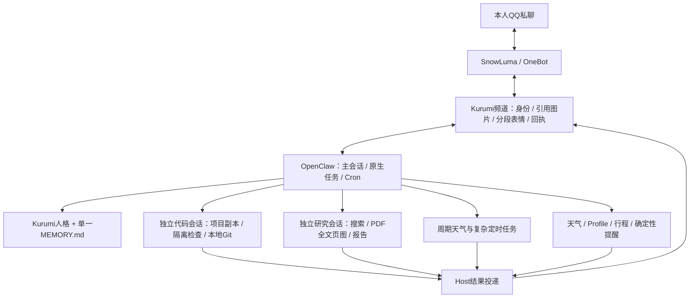

# QQ 融合助手架构与开发计划

现在应该从哪里继续：完整迁移技术验收与默认服务切换已完成。直接在本人QQ试用并反馈语气、分段及图片体验；后续开发从融合源码的当前干净提交继续。

## TODO 与现状

- [x] 两套旧方案保留，旧OpenClaw Git基线干净，融合源码/状态独立。
- [x] QQ本人私聊、引用、图片、短段节奏、表情库；真实投递和回读。
- [x] Kurumi人格、6条稳定资料、可列出/检索/更正/删除的显式记忆。
- [x] 天气、所在地、行程与确定性提醒迁移；短确认码、真实CRUD与跨重启送达对账。
- [x] 独立代码项目、隔离检查、本地Git、后台任务并发/查询/取消。
- [x] 独立全文研究、19页PDF文本、图表视觉核对、带来源/哈希/页码报告。
- [x] 周期天气真实创建、同ID修改、实际执行送达、取消。
- [x] 默认融合服务自启；旧助手停止/禁用；测试入口关闭；健康诊断。
- [x] Gateway崩溃后自动恢复、SnowLuma断线后自动重连。
- [x] 最终停机快照已恢复验证：9个SQLite完整性通过、项目Git有效、私有配置权限正确；最终源码与回滚包已归档。
- [ ] 主人亲自发QQ文本/引用/新图片，反馈陪伴语气与分段节奏；属于使用体验验收，不阻塞已授权的技术上线。

用户已选择Kurumi人格为主、代码先接入融合项目独立副本、验收后融合方案默认自启。可选技术分支自主采用推荐方案；真正不能决定的事项记录，不阻塞其他工作。当前无等待主人决策的技术阻塞。

## 已确定的架构

**OpenClaw是唯一助手宿主；Kurumi是人格与能力层；SnowLuma保留为QQ传输。DSH不嵌入主链路。**

原因以长期运行体验和维护成本为主：原生会话、取消、Cron和结果投递已经实测承担代码/研究/提醒；QQ自然交互可以在薄频道内复用。再接DSH会增加另一套会话、任务状态和升级契约，当前没有已验证的收益。以后确有专业执行器优势时可单独接入，不让第二宿主管理提醒、记忆或QQ投递。

没有另建通用任务引擎或第二个调度器。业务状态保留在原领域模块；频道只负责收发和回执。OpenClaw固定2026.9.7、ws固定8.21.3，启动时检查版本，升级必须重跑契约验收。

## 目录与回退基础

| 用途 | 精确路径 / 状态 |
| --- | --- |
| 融合源码 | `/home/afrangry/kurumi-fusion`，分支`integration/onebot`，独立clone --no-hardlinks，未推送 |
| 融合私有状态 | `/home/afrangry/.openclaw-fusion`，目录700、凭证600；Gateway loopback18890 |
| 主人格/记忆 | `.openclaw-fusion/workspace/{AGENTS,SOUL,IDENTITY,USER,MEMORY}.md`；私人正文不入源码Git |
| 项目注册表 | `.openclaw-fusion/projects.json`，当前项目`fusion` |
| 独立开发副本 | `.openclaw-fusion/projects/fusion`，独立Git，无远端；不会自动合入部署源码 |
| 固定外部检查 | `.openclaw-fusion/project-checks/`，在项目检查命名空间内只读 |
| 研究笔记/报告 | `.openclaw-fusion/research-workspace/reports/` |
| 原始PDF与页图 | `.openclaw-fusion/research-cache/papers/`，与可写笔记分离 |
| 真实验收证据 | `/home/afrangry/kurumi-fusion/docs/verification/migration/`；早期证据在`docs/verification/fusion/` |
| 旧OpenClaw | `/home/afrangry/.openclaw`，基线`e903c09`，标签`baseline/pre-integration-2026-10-05`；保留初稿后HEAD为`f8319c1`，Git干净 |
| 旧SnowLuma | `/home/afrangry/snowluma`，源码/配置不改造，仍作为传输使用 |
| 旧qq-bridge | `/home/afrangry/桌面/qq-bridge`，源码/配置不改造，服务停止/禁用 |
| 原方案完整备份 | `/home/afrangry/kurumi-baselines/2026-10-05-before-integration/` |
| 原型验收快照 | `/home/afrangry/kurumi-baselines/2026-10-05-fusion-acceptance/`，仅为原型检查点，不代表最终迁移 |
| 最终迁移快照 | `/home/afrangry/kurumi-baselines/2026-10-05-full-migration/`，runtime.tar.gz、固定SDK包、source.bundle、SHA256SUMS、checkpoint.json |

**今后的开发主要在kurumi-fusion；不要直接在原.openclaw上改造。** 原`.openclaw/docs/9_...`只是初始快照，本文为当前权威状态。早期比较依据保留在`/home/afrangry/snowluma/architecture-evaluation/REPORT.md`。

依赖仍复用本机只读安装：全局OpenClaw/ws、原领域node_modules及Tavily。不是可搬机器的一键安装包；不得删除旧目录中的依赖包，或直接在链接目录执行npm update。依赖路径与重建方式见`docs/10_融合助手运行维护.md`。旧方案源码、配置、状态完整保留；旧聊天历史未批量灌入新模型上下文。

## 能力、决策与实际边界

**QQ交互。** 仅本人365999865，群和其他收件人均拒绝。短闲聊2至3段，450ms间隔；代码、列表、长报告保留结构。复用qq-bridge格式化/表情索引副本，许可证及原始SHA在vendor目录；原表情库不写入。21条表情中仅3条已有标签，不能宣称全部自动理解。引用正文不变成授权原文，CQ文本不变成控制段，图片需暂存或通过限定QQ CDN校验。

**人格与记忆。** 保留Kurumi身份，精简行为提示。6条稳定资料从原USER迁入单一原生MEMORY.md，旧人格保存在私有migration/persona-before。记忆写入必须是本次本人原文明确“记住/修改记忆/忘记”，事实取原文子串；网页、引用、后台任务不授权。修订CAS、原子写入、凭证拒存；删除当前记忆不删除旧聊天/备份。自动记忆整理关闭。陪伴语气需要长期使用反馈，不能用一次闲聊替代主观验收。

**领域状态。** 通过SQLite backup复制天气/Profile/行程与提醒；9条旧提醒均终态，无旧活动提醒遗漏。新频道兼容旧qqbot领域协议，旧库未写。所在地原值在测试后恢复；测试行程标记取消且保留审计。行程目前支持新增/查询，沿用旧能力范围，不虚称支持修改/删除。

**确认与提醒。** 原始RawBody授权，可信本人/私聊/会话绑定。短码`确认 <12位>`由完整proposal ID/hash派生，歧义、过期、引用与裸“好的”拒绝；兼容原长确认格式。固定command Cron只由受限服务从已确认领域行构建，收件人/命令/工作目录固定，不把通用管理凭证交给模型。简单提醒执行不依赖模型；通过公开cron.list/cron.runs对账，不依赖已消失的内部cron_run_logs表。未知投递不自动重发。周期天气用原生automations，main的本人投递Cron仅开放天气只读权限，仍不能改领域状态；周期天气和复杂任务依赖模型/API可用。

**项目代码。** 主会话只提交项目ID和任务文字；Host拥有执行/状态/取消。固定检查和Git在Bubblewrap内运行，无主机私有目录、无网络，项目可写、外部检查只读。Git仅status/diff/branch/本地commit，commit显式paths并使用--only，不带入无关暂存文件。无任意主机shell、依赖安装和push；新增项目/检查由操作者配置。真实模型修复负revision与悬空符号链接问题，检查文件未改，修复审阅后已纳入部署源码。独立副本随后合入已验收主分支，HEAD为b955abe，检查范围扩大到全部融合离线测试及只读外部回归，隔离环境32项通过（36-project-synchronized.json）；副本工作区干净。

**全文研究。** 主聊天可在后台研究时继续回复。PDF来源限定arXiv/ACL/OpenReview/PMLR/NeurIPS，下载限25MiB；Poppler在Bubblewrap中有CPU/内存/时间上限。原始PDF有哈希与获取日期，text按offset读至EOF；图表公式用页图核对，报告明确PDF页码、范围与未做事项。样本为RAG v4，19页、87,001字符，实际核对PDF第2/6页；没有声称视觉看遍每页或复现实验。报告在`reports/rag-fulltext-acceptance.md`。

## 当前运行与数据

- `kurumi-fusion.service`：已enabled/active；用户Linger=yes，配置支持开机运行，未做整机断电/重启验收。
- `snowluma.service`、`snowluma-qq.service`：保留enabled/active，提供传输和QQ客户端。
- 旧用户`openclaw-gateway.service`、`qq-bridge.service`及系统`dsh-web.service`：inactive/disabled。单元文件保留；融合单元与前两个服务冲突，避免误开双助手。
- `testIngress=false`，测试RPC不可调用；临时慢工具已移除，原型worker配置退休，历史目录保留。
- 删除迁移累计40次限制，常态滚动24小时500次；分段每个物理发送都计数，失败/未知也占用，账本未清空。验收目前本人实际发送15条，全部sent且已回读。
- Gateway日志进入用户journal，旧gateway.log保留。健康检查核对Gateway、QQ online/good、频道、数据库、配额、服务及测试入口；合法启用提醒不会被判故障。
- 当前无启用测试任务；4条停用的Host心跳/审阅声明保留，不等同“Cron表为空”。不自动删除未来用户合法任务。

数据职责：Host的`state/openclaw.sqlite`与各`agents/*/agent/openclaw-agent.sqlite`是会话/调度事实来源；`channel/channel.sqlite`记录入站去重及出站预留/回执；`channel/task-receipts.jsonl`只保存任务run/session绑定；领域SQLite只负责对应业务状态；`MEMORY.md`是长期事实唯一来源。验收用native-tool-receipts记录在测试入口关闭后停止写入。

## 主要验收证据与修正

下表路径相对于`docs/verification/migration/`，未特别注明即本阶段证据。

| 证据 | 结论 |
| --- | --- |
| `06-domain-read.json`、`08-profile-confirmation.json` | 天气读取、未经确认拒写、确认写入/恢复、幂等 |
| `09-reminder-crud.json`、`10-reminder-restart-delivery.json`、`19-short-confirmation-model.json` | 真实短码CRUD、同ID更新、跨重启本人送达及公开API对账 |
| `11-planning-confirmation.json` | 日期未定行程保持null，确认后写入，原状态保留 |
| `13-memory-model.json` | 真实记忆增删改查、拒绝网页写入、测试后原6条哈希一致 |
| `15-qq-natural-sticker.json` | 两段文字约693ms间隔及晚安表情，真实QQ回读 |
| `22-project-maintenance.json`、`23-project-scoped-commit.json` | 初次修复通过但提交混入Host模板，22如实标部分失败；清理后限定文件提交c337875复验通过 |
| `24-paper-tests.txt`、`25-paper-fetch.json`、`26-fulltext-research.json` | 真实全文与2页视觉核验、研究报告，主聊天并发约6.4秒 |
| `27-recurring-weather.json` | 周期任务创建/修改/执行送达/删除；实际和风天气读取 |
| `28-research-cancel.json` | 真实查询/取消，aborted=true，rpc终止，无终态发送 |
| `29-fusion-regression.txt`、`30-weather-regression.txt`、`31-confirmation-regression.txt` | 31项融合、162项领域、17项确认核心通过 |
| `32-task-final.txt` | 任务审计kind从原start派生，6项任务/隔离回归通过 |
| `33-production-config.json`、`34-service-health.json` | 生产配置与当前服务/数据库/QQ健康 |
| `35-service-recovery.json` | 只杀已核实融合PID后systemd恢复；SnowLuma停启后自行重连 |
| `../fusion/receipts.json` | 15条本人QQ物理发送，真实回读段类型 |

必须记住的坑：

1. QQ真实消息ID也可能为负数；旧origin=unknown不得当作合成数据清理。此次生产切换保留全部聊天，没有自动reset会话。
2. Host工具必须声明contracts.tools；模型说完成不等于真实工具调用。allow和alsoAllow不能在同一作用域并用，coding profile可能过滤自定义工具。
3. runId可能是24位幂等键；status/cancel必须同时匹配已登记run/session。审计kind也从原start派生，不信调用方默认值。
4. plugin可能在临时capture目录加载，持久Cron cwd必须使用稳定部署目录。cron.add返回job.id；固定RPC端点仍需服务显式凭证。
5. 一次性Cron可能已自删除，不能无条件再删；未知送达不自动重试。禁用memory slot不会自动删除旧启用整理任务。
6. Git add-all会混入Host自动模板；已改显式文件提交并保留失败证据。不要因模型报告“仅改一个文件”免除Git复核。

## 最终备份与检查点

停机采集运行快照后已重新启动服务。runtime.tar.gz的SHA-256为`50910eb68f82ccd863ded7e01090452213c286a8b1b70d1e671fa77a0405b1d0`；固定SDK包为`202348542668ba28f7dbff49017e443f3b6ce21dce0ecc82d14926cf88ecbd75`，两包gzip完整性通过。运行快照已实际解压到独立目录，9个SQLite integrity_check通过、项目git fsck通过，未启动恢复副本或重复发送QQ；证据37-backup-restore.json。源码回滚点标签为`migration/full-2026-10-05`，具体HEAD与source.bundle校验记录在备份目录checkpoint.json。

旧方案完整快照是运行中采集，不能声称跨数据库事务一致；本次融合快照在服务停止时采集。固定SDK另存以防全局版本升级后难以回退；原领域/Tavily依赖仍可从旧方案备份恢复。

## 运维、回退与交接

日常操作、新增项目、构建/测试、恢复指令见`docs/10_融合助手运行维护.md`。服务停启与18890释放已实测，故障恢复已实测。未重新联网启动旧bridge，因为旧策略可能向未经本轮授权的其他人/群回复；不能声称旧链路端到端切回已验证。恢复不需要删除目录或git reset --hard。

继续遵循`docs/tp2.txt`：每阶段与压缩后读本文，保持状态快照，独立阶段提交，不推送、不提交密钥/私人记忆。使用额度重置卡必须剩余严格低于5%且仍有必要工作；第一张已在4%时成功使用，第二张保留，不为消耗额度继续测试。

主人醒来后建议亲自试：一张新图片并引用它、闲聊中启动项目任务、确认一个一分钟后提醒。技术架构无需重新拍板，重点反馈语气、消息节奏和主动程度。
