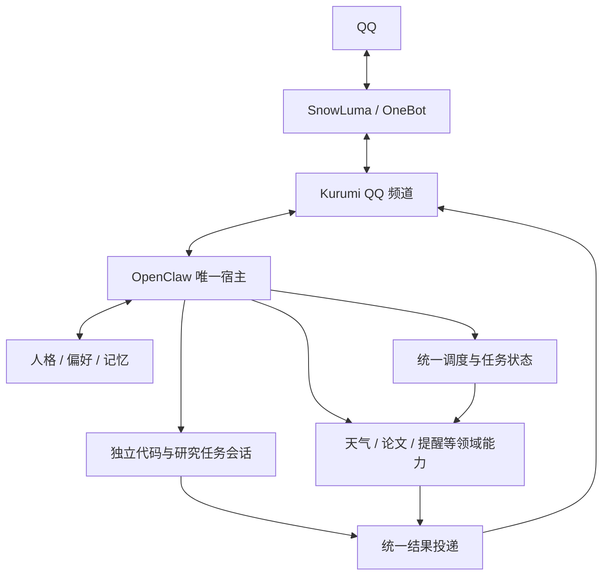

# QQ 融合助手架构与开发计划

现在应该从哪里继续：确认夜间真实 QQ 测试与两次额度重置的授权边界；其余准备可继续。随后建立独立融合开发副本，核查当前 OpenClaw 频道接口，完成最小双向 QQ 通路。

## TODO 与当前状态

- [x] 完成两套架构验证，明确 OpenClaw 主干、SnowLuma OneBot 通道的目标。
- [x] 收尾原 OpenClaw 工作区，基线提交 `e903c09`，标签 `baseline/pre-integration-2026-10-05`。
- [x] 阅读 `docs/tp2.txt`，建立本状态文档。
- [ ] 建立隔离的融合开发副本、分支、配置和可写状态目录，记录精确路径。
- [ ] 核查 QQ 频道 SDK、身份映射、已有确认核心和消息投递的接口契约。
- [ ] 从旧 qq-bridge 复制必要实现，保留来源、许可证和版本记录；原件不修改。
- [ ] 打通真实 QQ 入站、Kurumi 会话、文本/引用/图片出站的纵向原型。
- [ ] 验证聊天插话、后台任务、取消和结果归属，避免长任务堵塞主对话。
- [ ] 接入统一提醒及投递状态，验证创建/修改/取消、重启、断线和重复发送边界。
- [ ] 精简人格与能力注入，验证记忆边界、代码工作区和论文来源。
- [ ] 分阶段提交，记录验收、可恢复点、剩余阻塞和次日交接。

## 背景与目标

用户需要一个统一的个人 AI 助手，覆盖 QQ 聊天、情感陪伴、维护代码、查论文、天气、行程与提醒。迁移成本权重低于长期体感、维护复杂度和二次开发难度。

已完成架构验证：DSH 和 OpenClaw 均能完成同题小型代码修复；DSH 官方 schedule 支持跨重启唤醒，但投递回执只代表会话入队，模型故障可导致没有最终提醒。OpenClaw 的确认、调度和确定性提醒路径更适合本目标。真实 OneBot 文本、图片和隔离 OpenClaw 定时投递均成功，尚未证明正式频道双向集成与长期稳定性。

完整依据：`/home/afrangry/snowluma/architecture-evaluation/REPORT.md`；收尾依据：`/home/afrangry/.openclaw/docs/verification/2026-10-05_融合前基线收尾.md`。

## 已确定的架构与保护边界

1. OpenClaw 是唯一助手宿主，负责会话、工具循环及统一调度；Kurumi 承载人格和领域能力。第一阶段不增加 DSH 第二核心。
2. SnowLuma/OneBot 负责 QQ 接入。融合频道负责身份映射、引用、分段、图片、表情及投递接口，不另建任务和记忆系统。
3. 保留现有两套方案作为回退基础。`/home/afrangry/snowluma` 与 `/home/afrangry/桌面/qq-bridge` 原件不参与改造；复制必要配置和交互实现后在融合副本开发。
4. 用户明确当前没有生产环境，旧服务可按需停止。停止不等于删除，不允许为方便开发覆盖旧配置或旧状态。启动新 QQ 消费者前先确定旧消费者状态，避免双回复。
5. 原 OpenClaw 的源码通过基线标签保留，私有配置另有完整备份。开发优先使用独立副本及独立可写状态；具体路径在创建成功后更新，不能把计划路径写成已完成产物。
6. 配置可复用其结构与必要凭证引用，但新旧实例不得共用可写数据库、会话、任务表或相互冲突的端口。

模块表示职责，不要求各自常驻一个服务。简单提醒按确认后的确定内容定时发送；需要实时资料的任务才调用专业数据和模型。权限按身份、上下文和已授权任务范围管理，不把每个常规可逆操作都变成重复确认。

## 当前产物与数据状态

- 原仓库：`/home/afrangry/.openclaw`，Git 根在这里，`chatbot/` 为其子目录。
- 原源码基线：`e903c09`，基线前已有两个未推送提交；没有执行远端推送。
- 完整私有备份：`/home/afrangry/kurumi-baselines/2026-10-05-before-integration/`，含 `history.bundle`、`working-tree.patch`、`status-before.z`、`openclaw-full.tar.gz`。备份在服务运行时采集，不宣称运行数据库具有跨库事务一致性。
- 旧方案源码、配置、会话和领域数据库保留。本阶段未新建业务数据库或 SQL 表；融合数据清单、schema 与迁移策略须在实际探查后补齐。
- 基线收尾验收：天气/规划/提醒离线测试 156 项通过；新增或修改 `.mjs` 语法检查通过。不能将此等同于融合后端到端验收。

## 自主开发与验收规则

用户授权自主探查、调研、实现、测试和技术取舍。实现选择优先采用可验证、依赖少、易回滚的方案。遇到局部阻塞先隔离，继续其他独立工作。

每个阶段开始前完整重读本文及对应模块文档。上下文压缩后先恢复用户需求、文档状态与 Git 状态。本文始终反映当前快照：已验证结果替换原计划；新结论替换旧结论。值得防止重犯的错误单列原因，不保留相互冲突的现状。

每个可验收阶段提交一次，提交说明写清行为、验证与限制；不得将未通过验收的功能描述为完成。不自动推送远端，不公开配置或私有状态。测试记录保存到明确、持久的位置，新增脚本/表注明用途，不创建随意命名的重复业务实现。

核心验收场景：

- QQ 私聊准入、引用消息、连续输入、分段顺序、图片/表情，工具日志不泄漏到聊天。
- 同一用户的主聊天与后台代码/论文任务相互隔离，取消和结果归属正确。
- 提醒创建/原地修改/取消，重启后恢复；执行成功与发送成功分开；超时未知结果不盲目重发。
- 不同身份/会话不能继承主人授权，现有确认核心的上下文绑定与防重放保持有效。
- 论文输出有可核实来源；网页和任务资料不自动成为长期人格记忆。
- 停止融合实例后，能恢复旧服务链路；固定版本并记录升级契约风险。

## 当前待确认与阻塞

尚无阻塞全部开发的事项。以下只限制相关动作，其他开发照常：

1. 夜间是否可向本人真实 QQ 发测试消息及数量上限：等待最后一轮答复。此前四条消息授权已完成，不自动扩大为无限外发授权。在确认前仅做本地模拟/无外发测试，不向群或其他联系人发送。
2. 第一张与第二张额度重置卡的逐次明确授权：等待最后一轮答复。当前工具显示周额度已用 56%，剩余 44%，有两张卡；未使用。重置工具仅允许任一可见窗口剩余不高于 10% 时兑换。每次兑换需要独立幂等标识，结果不确定不得用新标识重复尝试。

后续无法自主解决的事项记录：具体问题、证据、已尝试方法、影响范围、推荐选项及需要用户提供的信息。次日集中交接；不要为了等待一个模块而停下全部可继续的开发。

## 下一阶段

收到最后一轮边界答复后更新本文，建立融合副本并验证其状态与端口隔离，再开始频道最小原型。尚未启动长期自动续跑机制，不把普通单轮回复当作已保证整夜持续执行；执行机制建立后记录实际目标、触发方式和停止条件。
