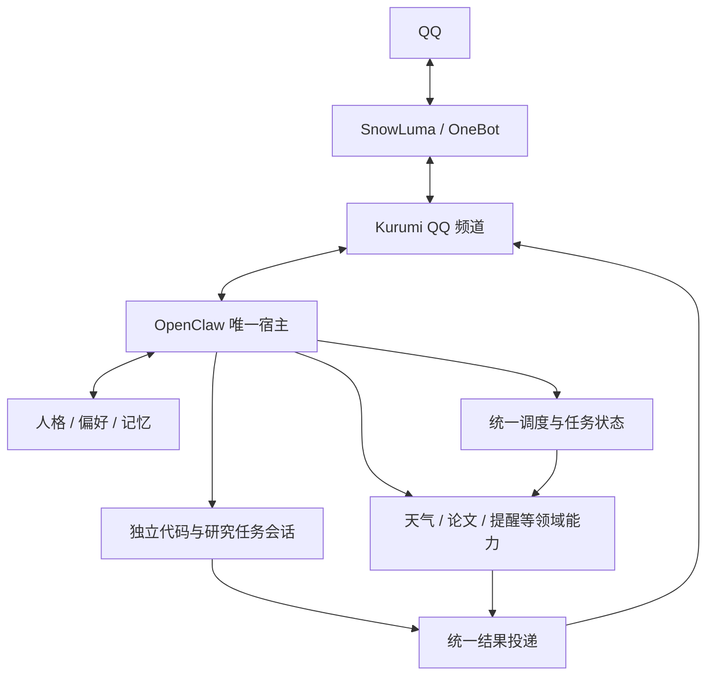

# QQ 融合助手架构与开发计划

现在应该从哪里继续：在 /home/afrangry/kurumi-fusion 实现薄 QQ 频道插件，完成离线契约测试后配置独立 Gateway。

## TODO 与当前状态

- [x] 完成两套架构验证，明确 OpenClaw 主干、SnowLuma OneBot 通道的目标。
- [x] 收尾原 OpenClaw 工作区，基线提交 `e903c09`，标签 `baseline/pre-integration-2026-10-05`。
- [x] 阅读 `docs/tp2.txt`，建立本状态文档。
- [x] 创建源码副本 `/home/afrangry/kurumi-fusion`，分支 `integration/onebot`；运行目录 `/home/afrangry/.openclaw-fusion` 已创建，配置隔离仍在实现。
- [x] 核查并实测当前频道 SDK、Host 路由与发送接口；现有业务确认核心的频道迁移仍待后续验证。
- [x] 复制 md-to-plain.js 与许可证，SHA-256 记录于插件 src/vendor/ORIGIN.md；原件未修改。
- [ ] 打通真实 QQ 入站、Kurumi 会话、文本/引用/图片出站的纵向原型。
- [ ] 验证聊天插话、后台任务、取消和结果归属，避免长任务堵塞主对话。
- [ ] 接入统一提醒及投递状态，验证创建/修改/取消、重启、断线和重复发送边界。
- [ ] 精简人格与能力注入，验证记忆边界、代码工作区和论文来源。
- [ ] 分阶段提交，记录验收、可恢复点、剩余阻塞和次日交接。

## 背景与目标

用户需要一个统一的个人 AI 助手，覆盖 QQ 聊天、情感陪伴、维护代码、查论文、天气、行程与提醒。迁移成本权重低于长期体感、维护复杂度和二次开发难度。

已完成架构验证：DSH 和 OpenClaw 均能完成同题小型代码修复；DSH 官方 schedule 支持跨重启唤醒，但投递回执只代表会话入队，模型故障可导致没有最终提醒。OpenClaw 的确认、调度和确定性提醒路径更适合本目标。真实 OneBot 文本、图片和隔离 OpenClaw 定时投递均成功，尚未证明正式频道双向集成与长期稳定性。

完整依据：`/home/afrangry/snowluma/architecture-evaluation/REPORT.md`；收尾依据：`/home/afrangry/.openclaw/docs/verification/2026-10-05_融合前基线收尾.md`。

## 已确定的架构与保护边界

1. OpenClaw 是唯一助手宿主，负责会话、工具循环及统一调度；Kurumi 承载人格和领域能力。第一阶段不增加 DSH 第二核心。
2. SnowLuma/OneBot 负责 QQ 接入。融合频道负责身份映射、引用、分段、图片、表情及投递接口，不另建任务和记忆系统。
3. 保留现有两套方案作为回退基础。`/home/afrangry/snowluma` 与 `/home/afrangry/桌面/qq-bridge` 原件不参与改造；复制必要配置和交互实现后在融合副本开发。
4. 用户明确当前没有生产环境，旧服务可按需停止。停止不等于删除，不允许为方便开发覆盖旧配置或旧状态。启动新 QQ 消费者前先确定旧消费者状态，避免双回复。
5. 原 OpenClaw 的源码通过基线标签保留，私有配置另有完整备份。开发优先使用独立副本及独立可写状态；具体路径在创建成功后更新，不能把计划路径写成已完成产物。
6. 配置可复用其结构与必要凭证引用，但新旧实例不得共用可写数据库、会话、任务表或相互冲突的端口。

模块表示职责，不要求各自常驻一个服务。简单提醒按确认后的确定内容定时发送；需要实时资料的任务才调用专业数据和模型。权限按身份、上下文和已授权任务范围管理，不把每个常规可逆操作都变成重复确认。

## 当前产物与数据状态

- 原仓库：`/home/afrangry/.openclaw`，Git 根在这里，`chatbot/` 为其子目录。
- 原源码基线：`e903c09`，基线前已有两个未推送提交；没有执行远端推送。
- 完整私有备份：`/home/afrangry/kurumi-baselines/2026-10-05-before-integration/`，含 `history.bundle`、`working-tree.patch`、`status-before.z`、`openclaw-full.tar.gz`。备份在服务运行时采集，不宣称运行数据库具有跨库事务一致性。
- 旧方案源码、配置、会话和领域数据库保留。本阶段未新建业务数据库或 SQL 表；融合数据清单、schema 与迁移策略须在实际探查后补齐。
- 基线收尾验收：天气/规划/提醒离线测试 156 项通过；新增或修改 `.mjs` 语法检查通过。不能将此等同于融合后端到端验收。

## 自主开发与验收规则

用户授权自主探查、调研、实现、测试和技术取舍。实现选择优先采用可验证、依赖少、易回滚的方案。遇到局部阻塞先隔离，继续其他独立工作。

每个阶段开始前完整重读本文及对应模块文档。上下文压缩后先恢复用户需求、文档状态与 Git 状态。本文始终反映当前快照：已验证结果替换原计划；新结论替换旧结论。值得防止重犯的错误单列原因，不保留相互冲突的现状。

每个可验收阶段提交一次，提交说明写清行为、验证与限制；不得将未通过验收的功能描述为完成。不自动推送远端，不公开配置或私有状态。测试记录保存到明确、持久的位置，新增脚本/表注明用途，不创建随意命名的重复业务实现。

核心验收场景：

- QQ 私聊准入、引用消息、连续输入、分段顺序、图片/表情，工具日志不泄漏到聊天。
- 同一用户的主聊天与后台代码/论文任务相互隔离，取消和结果归属正确。
- 提醒创建/原地修改/取消，重启后恢复；执行成功与发送成功分开；超时未知结果不盲目重发。
- 不同身份/会话不能继承主人授权，现有确认核心的上下文绑定与防重放保持有效。
- 论文输出有可核实来源；网页和任务资料不自动成为长期人格记忆。
- 停止融合实例后，能恢复旧服务链路；固定版本并记录升级契约风险。

## 当前待确认与阻塞

尚无阻塞全部开发的事项。以下只限制相关动作，其他开发照常：

1. 用户已明确授权夜间本人 QQ 测试，最多 10 条，仅 QQ 365999865，禁止群和其他联系人。本轮融合测试已发送 5/10 条（此前架构验证四条不计入本轮）。实现持久计数，失败且送达未知的尝试也占用额度，防止重启或重试绕过上限。
2. 用户已明确授权必要时依次使用两张重置卡；条件为可见额度窗口剩余严格低于 5%，且仍有必要工作未完成。任务提前完成不兑换。本轮尚未使用。
后续无法自主解决的事项记录：具体问题、证据、已尝试方法、影响范围、推荐选项及需要用户提供的信息。次日集中交接；不要为了等待一个模块而停下全部可继续的开发。

## 下一阶段

已建立本会话持续目标，范围是可验收的融合原型与交接，不无限增加功能。源码在独立克隆开发，原 OpenClaw 工作区停留在 f8319c1。后续状态以本副本的文档9为准；新 QQ 消费者已运行，旧 bridge 已停止；下一步验证原生任务并发与受限提醒工具。

## 阶段一当前实测

- 源码：`/home/afrangry/kurumi-fusion/chatbot/plugins/kurumi-qq/`。状态：`/home/afrangry/.openclaw-fusion`。独立 Gateway 端口 18890；配置、凭证、会话和频道 SQLite 独立于旧方案。
- 新频道已加载并连接真实 OneBot。旧 qq-bridge.service 已停止；SnowLuma/QQ 传输继续运行，配置未改。旧 OpenClaw、DSH 未停止。
- 合成主人入站通过 operator.admin 测试 RPC 进入真实 Host 与模型，产生一条真实本人 QQ 回复；重复事件被拒绝，未重复发送。证据：`docs/verification/fusion/01-native-inbound.json` 和 `receipts.json`。尚非真实人类 QQ 新消息验收。
- 八项离线契约测试通过，见 `docs/verification/fusion/02-channel-tests.txt`。媒体与引用的合成入站/真实模型/真实 QQ 输出已通过，见 03-native-media.json；尚未测试真实用户新上传图片。
- 插件默认为最终回复投递，不外发推理和工具日志。当前工具受限，尚未开放代码与研究后台任务。
- OpenClaw 会自动启用默认 memory-core；本副本已显式设置 memory slot 为 none，防止未验收的自动 dreaming 干扰原型。

## 阶段二当前实测与修正

- 原生 Cron 创建、同 ID 修改、取消测试通过；保留任务跨 Gateway 重启后，原生 command 执行 succeeded，经过新频道投递 delivered，QQ 回读成功。证据：`docs/verification/fusion/04-native-cron.json`。这是操作者创建的确定性任务，不等于自然语言管理工具已经通过。
- 最终采用原生 automations 管理自然语言提醒：真模型创建、修改、取消、list 验证通过，见 09-native-agent-reminder.json。使用 agentTurn + toolsAllow=[]，因此到点仍依赖模型。原生工具明确禁止 command payload；自定义封装虽能创建 command，但缺少管理授权，不能读取/修改它，故已停用并移除未发布封装，保留失败证据。没有通过管理员 token 绕过这一边界。确定性 command 提醒目前仅通过已验证的操作者路径创建；自然语言确定性提醒的正式服务接口列为后续待办。旧提醒领域模块和旧任务未改。
- 并发首次测试因 Gateway 未就绪失败；第二次暴露清单缺少 contracts.tools，等待工具未注册。模型输出完成标记不算完成，测试正确失败。补齐清单后复测通过：慢会话实际进入25秒等待工具，独立快会话约2.1秒完成；随后 chat.abort 成功取消慢会话，agent.wait 返回终止错误。仅验证原生普通会话隔离，不冒充已经实现 QQ 主会话的任务委派交互。失败证据保留为 05-native-concurrency-*attempt.json。
- 额度检查：剩余30%，两张重置卡均未使用。

## 阶段三实施中

- 新增 `chatbot/plugins/kurumi-tasks/`，以受限工具启动 OpenClaw 普通后台任务会话，由 Host 管理运行与取消，不新增调度器。目标固定 worker、固定隔离代码工作区，出站固定本人。正在真模型联调，不计为已完成。
- worker 工作区 `/home/afrangry/.openclaw-fusion/code-workspace`，文件工具限制在工作区；无通用 exec/网络/外发工具。固定测试能力只运行该目录的 Python unittest；测试脚本哈希须保持一致。
- 本轮渠道增加 Host durable delivery ID 去重和发送前取消/权限撤销检查。九项离线测试通过，真实 Host 队列重试场景仍待验证，不能声称任何故障下都不丢不重。
