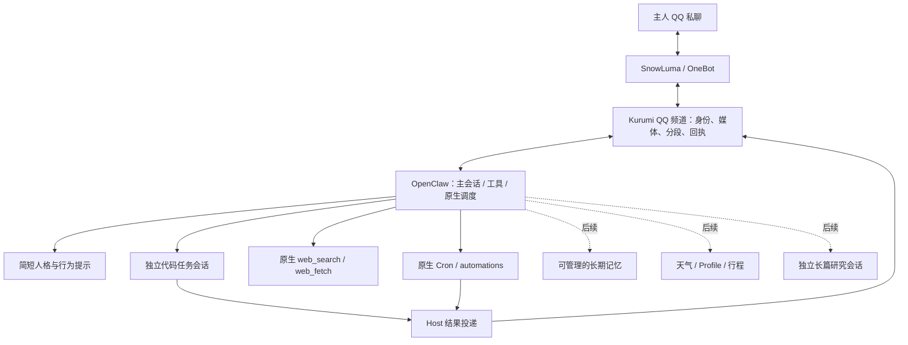

# QQ 融合助手架构与开发计划

现在应该从哪里继续：在 `/home/afrangry/kurumi-fusion` 做主人真实 QQ 交互验收，再按下方产品化 TODO 逐项推进；今晚的隔离融合原型已经完成技术验收，不能当作全部功能迁移完毕。

## TODO 与当前状态

- [x] 保存旧 OpenClaw 基线、清理 Git；两套原件保留，独立源码与运行目录已建立。
- [x] 写出并实测 OpenClaw 唯一宿主 + SnowLuma OneBot 频道的主路径。
- [x] 合成可信入站经过真实 Host/模型，真实本人 QQ 文本、引用、图片出站；重复入站拒绝。
- [x] 后台代码修复与主聊天并行、实际执行固定测试、查询/取消、QQ 结果回传。
- [x] 原生提醒创建/修改/取消；确定性 command 提醒跨重启投递；聊天创建的 agentTurn 提醒到点投递。
- [x] 公开论文搜索、读取 arXiv 原页面、给出来源并声明只读摘要。
- [x] 15 项融合离线测试通过；关闭测试 RPC；轮换合成测试会话；核查无启用中定时任务。
- [ ] 主人亲自发 QQ 文本、引用、新上传图片，检查自然对话手感与连发体验。
- [ ] 从旧交互代码逐项迁入语义分段、表情选择与节奏控制；目前只有格式化、长度分段及图片传输。
- [ ] 把代码样例工作区扩展为明确的项目注册表，增加每项目检查命令、任务状态入口及更强执行隔离。
- [ ] 把长篇论文研究接入独立任务会话，验收 PDF 全文、引用位置和研究中插话；目前搜索在主会话完成。
- [ ] 迁移天气/Profile/行程，适配新频道可信身份后回归原确认核心；当前融合实例尚未加载这些领域插件。
- [ ] 接入主人可查看/更正/删除的长期偏好记忆，验证网页与临时聊天不会自动晋升；目前自动记忆关闭。
- [ ] 补自然语言确定性提醒的正式服务接口、异常提示和运维界面，再制定常态外发配额与 systemd 上线方案。

以上未完成项是后续产品化工作，不是需要主人替我做技术选择的阻塞。唯一必须由主人参与的是实际 QQ 操作与陪伴风格的主观反馈。推荐先试用基本闭环，再逐项迁移，不一次搬入旧系统全部规则。

## 架构取舍与原因

**采用 OpenClaw 作为唯一助手宿主，Kurumi 作为人格与能力组织层，SnowLuma 作为 QQ 传输。暂不把 DSH 再嵌入 OpenClaw。**

判断依据不是迁移成本：新频道已经复现真实文本/引用/图片投递，OpenClaw 的原生会话和调度也实际承担了后台代码任务、取消和提醒，因此没有必要同时维护两套会话、任务、记忆与故障状态。DSH 的交互优点优先在频道层复用；若以后出现原生宿主确实不能满足的任务，再评估是否需要外部执行器。



新代码只补频道与薄任务适配器；没有新建通用任务引擎、第二个调度器或人格记忆引擎。插件依赖当前已安装 OpenClaw 2026.9.7；升级前必须重跑契约验收，启动脚本会拒绝不匹配的 SDK 版本。

### 当前体验的实际边界

- 主聊天可快速接受代码任务后继续聊天；后台结果由 Host 直接回到同一主人。代码示例6项测试通过，取消确实终止运行。
- 提醒支持自然语言管理，但 **agentTurn 提醒到点仍需模型可用**。不依赖模型的 command 提醒只验证了操作者创建路径，尚未完成自然语言管理接口。
- 搜索是原生能力，论文样本验证的是元数据和摘要，不是 PDF 全文研究。搜索较慢时仍可能占用主会话。
- 人格模板已精简，闲聊不强制任务化；陪伴质量尚无长周期或主人主观验收。不能据一次聊天声称已完成情感陪伴迁移。
- worker 文件工具限制在样例工作区，没有通用 shell 工具；固定 Python 检查仍会执行项目代码，这不是完整的操作系统沙箱。

## 保护边界与精确路径

| 用途 | 路径 / 状态 |
| --- | --- |
| 原 OpenClaw 源码 | `/home/afrangry/.openclaw`，Git 根在此；基线 `e903c09`，标签 `baseline/pre-integration-2026-10-05`；保留文档初稿后停在 `f8319c1` |
| 原 SnowLuma | `/home/afrangry/snowluma`，源码/配置未参与改造，继续提供 QQ 传输 |
| 原 qq-bridge | `/home/afrangry/桌面/qq-bridge`，源码/配置未修改；`qq-bridge.service` 已停止 |
| 原完整备份 | `/home/afrangry/kurumi-baselines/2026-10-05-before-integration/`，含已验证 Git bundle、工作树差异、状态清单、完整运行目录 tar.gz |
| 融合源码 | `/home/afrangry/kurumi-fusion`，独立 clone --no-hardlinks，分支 `integration/onebot`；不推送远端 |
| 融合运行状态 | `/home/afrangry/.openclaw-fusion`，目录700、凭证600；Gateway `127.0.0.1:18890` |
| 频道源码 | `/home/afrangry/kurumi-fusion/chatbot/plugins/kurumi-qq/` |
| 任务适配器 | `/home/afrangry/kurumi-fusion/chatbot/plugins/kurumi-tasks/` |
| 主人格模板 | `/home/afrangry/kurumi-fusion/scripts/fusion/templates/AGENTS.md`；运行副本在 `.openclaw-fusion/workspace/` |
| 隔离代码样例 | `/home/afrangry/.openclaw-fusion/code-workspace`；固定测试原件在融合源码 `scripts/fusion/fixtures/test_stats.py` |
| 验收证据 | `/home/afrangry/kurumi-fusion/docs/verification/fusion/` |
| 早期架构对比 | `/home/afrangry/snowluma/architecture-evaluation/REPORT.md` |

**后续主要工作在 kurumi-fusion，不在原 `.openclaw` 中直接改造。本文是当前权威状态；原 `.openclaw/docs/9_...` 仅保留开始时的快照。**

运行时仍借用只读已安装 OpenClaw、ws 和 Tavily 插件包；这是同一台机器上的原型部署，还不是可搬机器的独立安装包。旧 OpenClaw 18789 与 DSH 仍可作为回退基础保留；新方案不调用 DSH。禁止同时启动旧 qq-bridge 和融合 QQ 消费者，启动脚本已检查旧 bridge 状态。

原始完整备份是在旧服务运行时采集，不能宣称跨数据库事务一致。融合副本已在停止18890进程后生成停机快照 `/home/afrangry/kurumi-baselines/2026-10-05-fusion-acceptance/runtime.tar.gz`，gzip完整性验证通过，SHA-256 `225eedd7cdd5186a1713b7766273b23ad30e3dd210b03aa67ee9d51cdacee34f`；不要混淆两种备份保证。

## 数据与外发

- `channel/channel.sqlite`：`inbound(id,status,at)` 存入站去重；`outbound(id,status,message_id,at)` 存投递预留和回执。不是业务记忆或第二套调度库。
- Host 数据：`state/openclaw.sqlite` 与 `agents/{main,worker}/agent/openclaw-agent.sqlite`；不与旧目录共享可写数据库。
- `channel/task-receipts.jsonl` 只保存任务工具的真实运行标识与结果，用于查询/取消时绑定 sessionKey/runId。Host 是运行状态事实来源。
- `channel/native-tool-receipts.jsonl` 是验收记录，测试入口关闭后不再通过该 hook 写入。
- 图片只允许已暂存文件或受限 QQ CDN 入站；正文中的 CQ 字符串不提升为可信控制段。引用只读取同一主人私聊的消息。
- 发送仅允许 QQ 365999865，群与其他收件人均拒绝。**本轮真实外发7/10条，7条均有回执并回读。** 失败/未知尝试同样占用持久配额，重启不能绕过。
- Host durable delivery ID 可用时作为幂等键；已成功的相同键复用回执。回执丢失则 unknown，不自动重发。没有 durable ID 的普通调用不能保证全局恰好一次。
- 入站失败保留 failed，不自动重新运行可能已产生副作用的模型回合。下一阶段应补主人可见的诊断入口。

## 验收证据与已修正的坑

| 证据 | 已验证内容 / 限制 |
| --- | --- |
| `01-native-inbound.json` | 合成主人入站→真实Host/模型→本人QQ；重复事件拒绝 |
| `02-channel-tests.txt` / `17-final-tests.txt` | 频道12项 + 任务3项；目标限制、去重、媒体边界、取消屏障、未知回执、防重复发送、错误状态、任务身份绑定 |
| `03-native-media.json` | 暂存图片与引用进真实模型；真实QQ引用/文本/图片出站。尚非主人新上传图片 |
| `04-native-cron.json` | 原生command任务创建、同ID修改、取消；跨重启后执行及投递成功 |
| `05-native-concurrency.json` | 实际25秒慢工具启动，另一普通会话约2.1秒完成，慢会话取消成功 |
| `06...` / `07...` / `08...` | 被放弃的自定义提醒封装与command管理失败证据，不是现行通过项 |
| `09-native-agent-reminder.json` | 真模型通过automations创建、修改、取消、列表核对 |
| `10-background-code.json` | QQ主会话启动后台代码修复；主聊天并行；后台结果本人QQ回传。首次未执行检查工具，报告如实披露 |
| `11-worker-check.json` | 修正工具策略后，真实worker实际调用固定检查工具，6项通过；独立Python测试同样6项通过，测试文件哈希未变 |
| `12-task-control.json` | 实际task工具status/cancel；aborted=true，终态error/stopReason=rpc，没有终态外发 |
| `13-natural-reminder-delivery.json` | 聊天创建agentTurn提醒，实际到点succeeded/delivered，自动删除；并经QQ回读 |
| `15-research.json` | 实际web_search + web_fetch读取arXiv，正确作者/年份/链接，明确只读摘要 |
| `16-closeout.json` / `18-final-runtime.json` | 合成会话原生轮换、测试入口关闭且RPC不可调用、频道连接、无启用中任务、发送账本保留 |
| `receipts.json` | 已发送7条的脱敏消息ID与实际回读段类型 |

需要保留的实现教训：

1. 工具必须在 manifest 声明 `contracts.tools`；模型口头说“完成”不能代替实际调用。未注册慢工具时模型曾输出完成标记，测试按真实marker正确判失败。
2. 每个工具作用域不能同时配置 allow 与 alsoAllow；多agent需 explicit ownership。coding profile 与 allow 求交会滤掉自定义检查工具；worker现用 full profile + 精确5项 allow，绝非全部开放。
3. native agent 的 runId 可以是调用方24位幂等键，不能假定UUID。查询/取消同时校验已登记run/session配对。
4. 原生 automations 禁止模型创建command；自定义封装缺少管理授权时不能伪装成功。未通过的封装已移除，没有向模型工具注入管理员凭证绕过边界。
5. 一次性提醒自动删除后，不应再次无条件删除。首版验收清理脚本因此报错，后续按持久Cron记录核对，未重发。
6. **关闭memory slot不自动删除以前登记的记忆整理Cron。** 收尾发现一条enabled的旧自动声明，已通过原生API移除并跨重启确认未再出现。三个disabled的heartbeat/skill review声明保留，无启用中任务。早先“列表为空”的说法已修正为“没有测试提醒/没有启用中任务”。

## 启动、检查与回退

当前是手动启动的试运行，不安装新的开机服务。SnowLuma/QQ原服务继续运行；旧bridge仍有原自启设置，整机重启后先检查，不能直接再启动融合消费者。

```bash
cd /home/afrangry/kurumi-fusion
node scripts/fusion/link-dependencies.mjs
systemctl --user stop qq-bridge.service
node scripts/fusion/run-gateway.mjs
```

运行命令占用前台；不要同时重复启动。另一个终端只读检查：

```bash
cd /home/afrangry/kurumi-fusion
node scripts/fusion/probe-final.mjs
node scripts/fusion/inspect-receipts.mjs
```

`probe-final` 的“无启用任务”断言仅适用于本轮空任务交接，日后用户真实创建提醒后应按业务状态查看，不能把存在合法提醒当故障。

退回原 SnowLuma/DSH 链路：

```bash
cd /home/afrangry/kurumi-fusion
node scripts/fusion/stop-gateway.mjs
systemctl --user start qq-bridge.service
```

已实测融合停止后18890释放、再次启动连接正常。没有实际重启旧bridge做联网回滚验收，避免旧规则向未授权联系人或群发言。回退不需要删除融合目录或修改原件，也不需要 git reset --hard。

新建运行目录时依次执行 `prepare.mjs`、`configure-worker.mjs`、`configure-research.mjs`；prepare拒绝覆盖既有文件。需要先由上述link脚本确认本机依赖版本。不要直接复制整套旧运行目录覆盖融合状态。

## 自主开发规则与次日交接

继续遵循 `docs/tp2.txt`：每阶段及压缩恢复后完整读本文；维护当前状态而不是堆叠相互矛盾的计划。独立阶段提交，验收结果有持久证据；不自动推送，不提交密钥、运行库或私人记忆。

用户授权夜间本人QQ测试，禁止其他人/群。10条是本轮验收上限，当前尚余3条；长期使用前应另行制定常态策略，不擅自清空账本解除限制。

两张重置卡仅在剩余额度严格低于5%、且仍有必要工作时依次使用；本轮在剩余4%、必要收尾尚未完成时使用了第一张，工具确认reset成功，第二张保留。任务结束后不继续消耗或兑换。

明天无需先替我决定架构。推荐直接试三件事：发一张图片并引用它、闲聊中要求启动代码任务、创建一分钟后的简单提醒；具体发送次数仍受剩余配额限制。真正需要你反馈的是回复语气、分段节奏和主动程度。其他技术项按TODO和验收结果自主推进。
